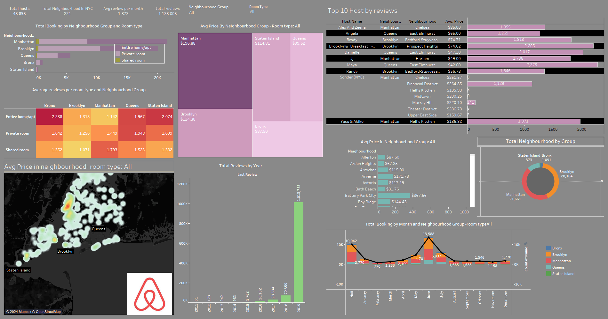
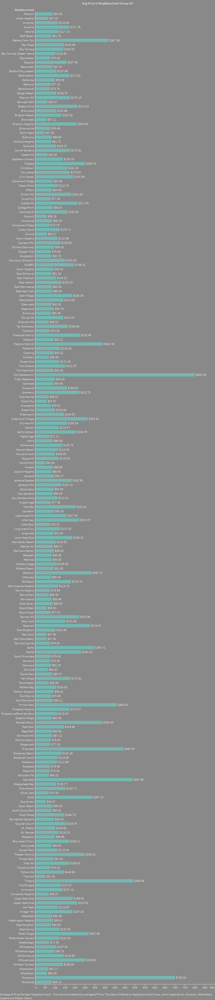
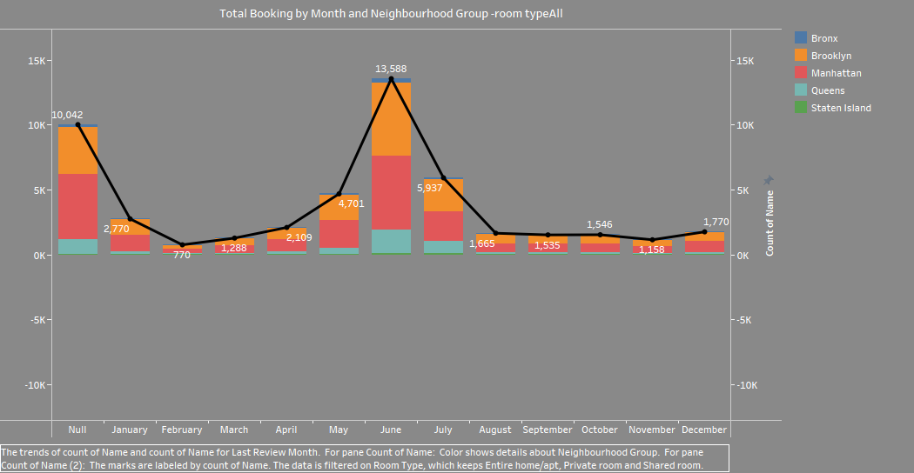
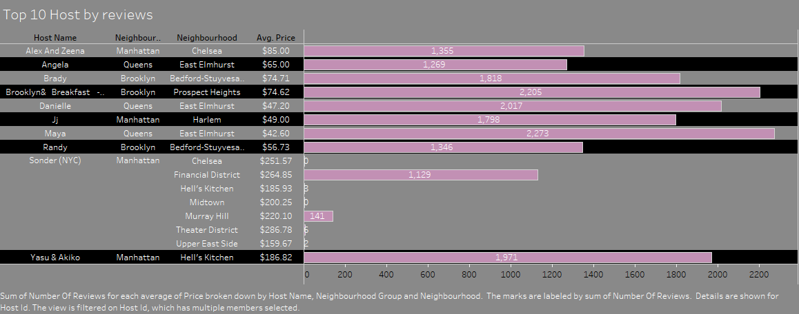

 
# AirBNB-Dataset
Used the AirBNB data set found on the internet and using various technologies such as Python,Tableau for understanding the data.
Exploratory Data Analysis 
[Python](https://github.com/ab39912/AirBNB-Dataset/blob/main/python/AirBNB.ipynb)  
[Tableau](https://github.com/ab39912/AirBNB-Dataset/tree/main/tableau)  

### Dashboard 
* Overview: listings, accomodations available, average price($), average rating, and total reviews info per neighbourhood 
 

* Filtering: Giving the insight of finding the avg price in each location 
 

* Key Insights: Displaying the insights on the neighbourhood by displaying the total booking by month  
 

 * Also finding the Top 10 Hosts by reviews and displaying the avg price in table and also in the form of bar graph
   
